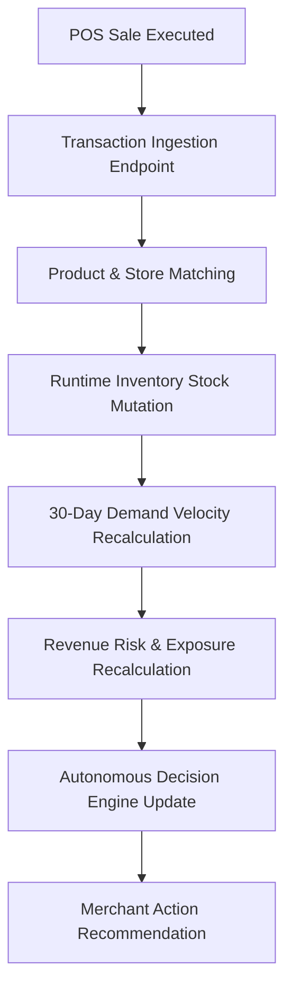

# MerchIntell

MerchIntell is a retail revenue intelligence copilot that detects revenue leaks, explains their causes, and recommends actions before losses grow.

---

## The Problem

Traditional retail management tools report historical transactions and current stock levels:
- **What sold?** (Historical sales figures)
- **What is in stock?** (Current inventory levels)
- **What was the total revenue?** (Past financial performance)

However, traditional tools fail to answer critical forward-looking operational questions:
- **Which products are actively becoming revenue risks right now?**
- **Why is a specific product losing or exposing potential revenue?**
- **How much revenue is currently exposed across stores?**
- **What concrete action should the merchant take to recover or protect revenue?**
- **How does a live POS sale immediately update stock, demand velocity, and revenue exposure?**

Without real-time closed-loop revenue intelligence, merchants experience silent profit leaks: stockouts on high-velocity items, cash tied up in slow-moving overstock, and delayed manual reordering decisions.

---

## The Solution

MerchIntell bridges POS transaction processing, inventory tracking, demand velocity modeling, revenue risk quantification, and decision optimization into a single unified closed-loop platform:

- **Historical Baseline**: Analyzes 125,751 historical retail sales records and 284,755 inventory records across 40 stores.
- **Live POS Ingestion**: Ingests point-of-sale transactions and immediately updates stock levels, 30-day demand velocity, and store revenue exposure.
- **Revenue Leak Detection**: Classifies products into deterministic risk categories (`STOCKOUT`, `OVERSTOCK`, `EXPIRY_RISK`, `MARGIN_EROSION`).
- **Autonomous Decision Engine**: Evaluates decision strategies (e.g., *Restock*, *Transfer Stock*, *Markdown*, *Do Nothing*) using multi-objective scoring (Revenue Impact, Profit Margin, Customer Retention, Execution Risk).
- **Merchant-First Experience**: Presents quiet, uncluttered dashboards with human-readable display names and actionable priority lists.

---

## Core Workflow



---

## Key Features & Capabilities

1. **Closed-Loop Transaction Processing**: Real connected POS workspace for processing sales (`POST /api/transactions`), writing to persistent transaction ledgers (`data/pos_database.json`), deducting inventory, and generating printable customer receipts (`INV-20260825-XXXX`).
2. **Deterministic Risk & Opportunity Engine**: Scans store catalogs to highlight top actionable revenue leaks, quantifying revenue exposure in ₹.
3. **Live Store Activity System**: Includes controlled auto-billing simulation (30–90s interval) for live store operational demos without mock UI state.
4. **40 Multi-Store Filtering**: Instant store selection (`STR-1001` .. `STR-1040`), displaying store-specific metrics, stock levels, and revenue risks.
5. **Product Intelligence Drawer**: Progressive disclosure showing raw SKU IDs, segment data, stock cover, gross margin %, and detailed deterministic risk rationale.
6. **Multi-Objective What-If Simulator**: Monte Carlo decision simulation engine comparing recommended interventions against baseline scenarios.
7. **Comprehensive Test Suite**: 82 automated pytest backend tests passing with 100% success rate.

---

## Architecture Overview

MerchIntell uses a decoupled architecture with a Python/FastAPI backend and a React/TypeScript/Vite frontend:

- **Backend**: Python 3.11, FastAPI, Pydantic, Pandas, NumPy, pytest.
- **Frontend**: React 18, TypeScript, Vite, Vanilla CSS design tokens, Lucide React icons.
- **Persistence**: File-backed POS transaction database (`data/pos_database.json`), SQLite (`merchant_autopilot.db`), and CSV datasets.

---

## Quick Start

### 1. Backend Setup
```bash
# Navigate to backend
cd backend

# Install Python dependencies
pip install -r requirements.txt

# Start FastAPI application
python -m uvicorn app.main:app --reload --port 8000
```
Backend API will run at `http://localhost:8000`. API documentation available at `http://localhost:8000/docs`.

### 2. Frontend Setup
```bash
# Navigate to frontend
cd frontend

# Install Node dependencies
npm install

# Start Vite dev server
npm run dev
```
Frontend application will run at `http://localhost:5173`.

---

## Live Demo

Live Demo: [DEPLOY AFTER DEPLOYMENT]

---

## Deployment

MerchIntell is configured for zero-downtime deployment on Render and Vercel using `render.yaml` blueprint specifications:

- **Backend**: Python/FastAPI Web Service running Uvicorn on Render (`0.0.0.0:$PORT`), with configurable `CORS_ORIGINS` and `/var/data` persistent disk mount.
- **Frontend**: React/Vite Static Site on Render/Vercel with SPA rewrite rules (`/* → /index.html`) and `VITE_API_BASE_URL` environment resolution.

For detailed step-by-step instructions, view the [Deployment Guide](docs/DEPLOYMENT.md).

---

## Running Verification Tests

```bash
# Run 82 backend test suite
python -m pytest tests/ -v

# Run production frontend build
cd frontend && npm run build
```

---

## Detailed Documentation Map

Explore complete technical specifications in the [`docs/`](./docs) directory:

- [Problem Statement](docs/PROBLEM_STATEMENT.md) — Detailed breakdown of retail revenue leaks and traditional tool gaps.
- [Solution Overview](docs/SOLUTION.md) — Architectural design of MerchIntell's revenue copilot.
- [System Architecture](docs/SYSTEM_ARCHITECTURE.md) — High-level system components and integration topology.
- [Technical Architecture](docs/TECHNICAL_ARCHITECTURE.md) — Backend services, API routing, and state flow.
- [Data Architecture](docs/DATA_ARCHITECTURE.md) — CSV dataset schemas, SQLite tables, and runtime mutation models.
- [POS Transaction Flow](docs/POS_TRANSACTION_FLOW.md) — Step-by-step transaction ingestion and closed-loop state updates.
- [Revenue Risk Engine](docs/REVENUE_RISK_ENGINE.md) — Risk classification algorithms and exposure calculation formulas.
- [Decision Engine](docs/DECISION_ENGINE.md) — Multi-objective normalized decision scoring and scenario execution.
- [API Documentation](docs/API_DOCUMENTATION.md) — Full REST API specifications and payloads.
- [Project Structure](docs/PROJECT_STRUCTURE.md) — Repository layout and module descriptions.
- [Testing & Validation](docs/TESTING_AND_VALIDATION.md) — 82 backend pytest suites and frontend build validation.
- [Deployment Guide](docs/DEPLOYMENT.md) — Step-by-step Render and Vercel production deployment.
- [Demo Guide](docs/DEMO_GUIDE.md) — Recruiter & judge 10-second walkthrough script.
- [Design Decisions](docs/DESIGN_DECISIONS.md) — Rationale for minimal visual design, vanilla CSS, and data honesty.
- [Known Limitations](docs/KNOWN_LIMITATIONS.md) — Operational boundaries and dataset assumptions.
- [Roadmap](docs/ROADMAP.md) — Future enhancements and enterprise features.
