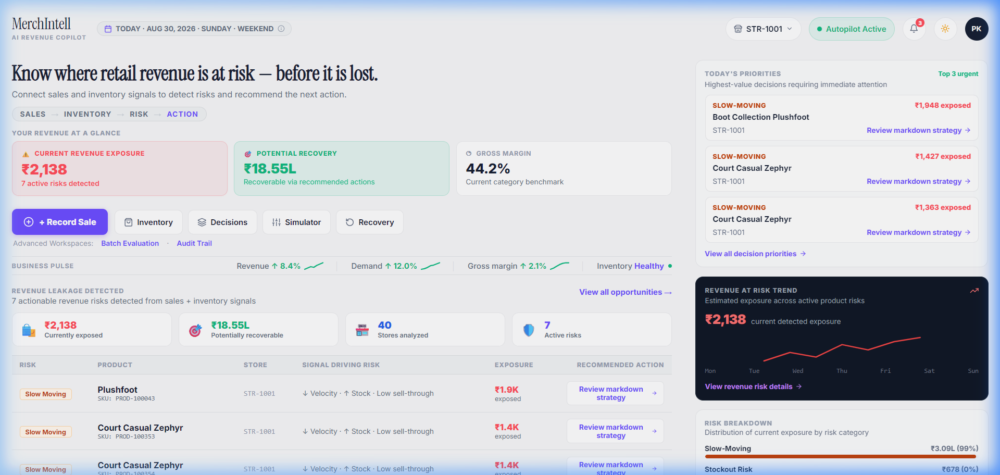
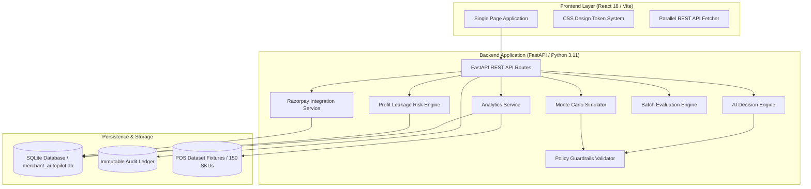
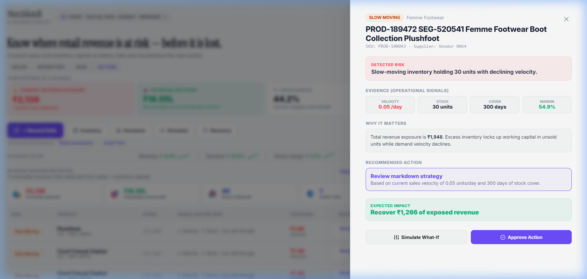
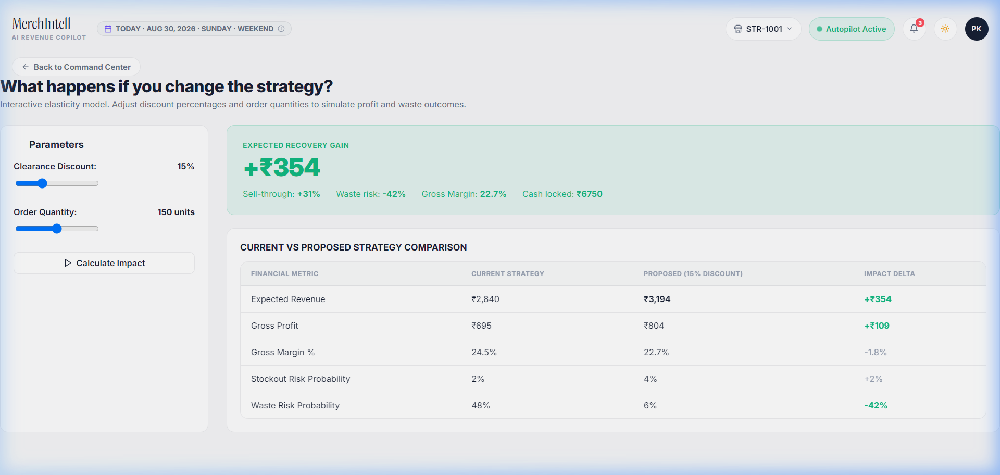
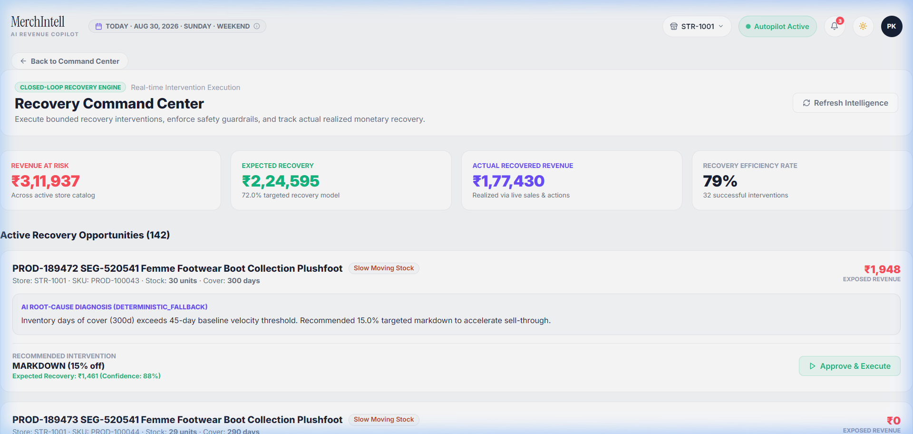
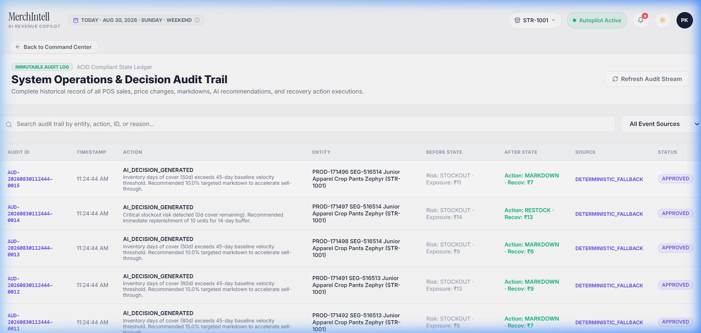

# MerchIntell

> **AI-assisted retail revenue intelligence that detects revenue leakage, explains why it happens, recommends bounded recovery actions, and measures the outcome.**

[](https://github.com/Sanjay34598/merchent-revenue-automation/actions/workflows/ci.yml)
[](https://github.com/Sanjay34598/merchent-revenue-automation)
[](https://github.com/Sanjay34598/merchent-revenue-automation)
[](LICENSE)

- **Live Demo**: [https://merchintell.vercel.app](https://merchintell.vercel.app)
- **GitHub Repository**: [https://github.com/Sanjay34598/merchent-revenue-automation](https://github.com/Sanjay34598/merchent-revenue-automation)
- **Demo Video**: *Demo video coming soon*



---

## The Problem

Traditional Point-of-Sale (POS) dashboards and ERP reports excel at backward-looking accounting:
- **What sold yesterday?**
- **What is currently sitting in inventory?**
- **What was last month's aggregate revenue?**

However, standard retail software fails to connect sales velocity and inventory cover to answer critical operational questions:
1. **Where is revenue silently leaking right now?**
2. **Why is a specific SKU exposing financial risk?**
3. **What concrete, bounded action should the merchant execute to recover revenue?**
4. **Did the executed intervention actually recover monetary value?**

Without forward-looking revenue intelligence, retail merchants suffer silent profit leakage: stockouts on high-velocity items, working capital locked in slow-moving overstock, unoptimized markdowns, and unmeasured interventions.

---

## What MerchIntell Does

MerchIntell closes the loop between detecting revenue risk and executing a controlled recovery action through a 5-stage continuous decision cycle:

$$\text{DETECT} \longrightarrow \text{DIAGNOSE} \longrightarrow \text{INTERVENE} \longrightarrow \text{RECOVER} \longrightarrow \text{MEASURE}$$

- **DETECT**: Continuously scans POS transactions and inventory snapshots to quantify monetary revenue exposure across catalog SKUs.
- **DIAGNOSE**: Evaluates demand velocity, days of stock cover, margin profiles, and day-of-week seasonality to isolate root causes.
- **INTERVENE**: Formulates bounded operational strategies (`MARKDOWN`, `RESTOCK`, `PROMOTION`, `STOCK_TRANSFER`) ranked by expected financial recovery.
- **RECOVER**: Enforces programmatic policy guardrails (margin floors, discount caps, cash exposure limits) and requires explicit merchant approval before execution.
- **MEASURE**: Tracks post-execution sales variance against predicted baseline expectations to calibrate future decision confidence.

---

## Why It Is Different

| Traditional Retail Dashboard | MerchIntell Decision Intelligence |
|---|---|
| Historical sales reporting | Active revenue risk detection |
| Static inventory counts | Connected demand + inventory velocity modeling |
| Backward-looking metrics | Root-cause risk diagnosis |
| Displays unstructured problems | Recommends bounded, actionable recovery steps |
| Static reporting | Stochastic scenario simulation (Monte Carlo) |
| No outcome tracking | Closed-loop recovery & evidence learning |

---

## Product Workflow

```
POS Transactions & Catalog State
               │
               ▼
Revenue Risk Engine (Stockout, Slow-Moving, Margin Leak, Overstock)
               │
               ▼
AI Decision Intelligence & Monte Carlo Simulator
               │
               ▼
Deterministic Policy Guardrails (Margin Floor ≥ 10%, Discount Cap ≤ 30%)
               │
               ▼
Merchant Approval & Bounded Execution
               │
               ▼
Razorpay Order Payload / Payment Link Generation (INR Paise)
               │
               ▼
POS Inventory Mutation & Live Analytics Recalculation
               │
               ▼
Immutable Audit Ledger & Outcome Measurement
```

---

## Architecture



### Architecture Specifications
- **Persistence Layer**: **SQLite** (`merchant_autopilot.db`) mapped via SQLAlchemy ORM serves as application persistence. JSON dataset files in `backend/data/` act as initial catalog fixtures and baseline seed data.
- **Frontend Architecture**: Built with React 18, TypeScript, and Vite 5. Employs code-splitting via `React.lazy()` for secondary workspaces and instant frame-1 rendering.
- **Decision Engine**: Combines EWMA demand forecasting, multi-objective utility trade-off scoring, 1,000-run Monte Carlo stochastic simulation, and LLM reasoning with deterministic fallback.

---

## Core Features

- **Revenue Risk Detection**: Categorizes SKU risk into `STOCKOUT`, `SLOW_MOVING`, `MARGIN_LEAK`, and `OVERSTOCK`.
- **Demand Forecasting**: EWMA forecaster accounting for day-of-week seasonality and stockout-constrained demand.
- **What-If Decision Simulator**: Monte Carlo scenario simulator evaluating 1,000 demand iterations under price elasticity curves.
- **Multi-Objective Decision Scoring**: Utility scoring balancing profit, stockout risk, waste risk, cash exposure, and execution risk.
- **Deterministic Policy Guardrails**: Programmatic policy checks enforcing margin floors and discount caps.
- **Merchant Approval Workflow**: Bounded execution state machine requiring human merchant confirmation for action execution.
- **Razorpay Payment Integration**: Generates standard Razorpay Order payloads in integer INR paise with test/live mode fallback.
- **POS State Mutation**: Real-time inventory deduction and instant analytics summary updates without page reload.
- **Immutable Audit Trail**: ACID-compliant audit log recording every system operation, price update, and merchant decision.

---

## AI & Decision Intelligence

MerchIntell implements **AI-assisted decision intelligence** rather than autonomous unmonitored execution. Every AI recommendation is bounded by policy constraints and merchant approval.

### 1. Multi-Objective Decision Utility Scoring
Candidate recovery actions are evaluated against the status quo (`DO_NOTHING`) using normalized multi-objective trade-off scoring:

$$\text{Score} = 0.40 \cdot \text{Profit}_{\text{norm}} - 0.25 \cdot \text{Stockout}_{\text{norm}} - 0.15 \cdot \text{Waste}_{\text{norm}} - 0.10 \cdot \text{Cash}_{\text{norm}} - 0.10 \cdot \text{Risk}_{\text{norm}}$$

### 2. Deterministic Safety Guardrails
AI suggestions cannot bypass policy constraints. Programmatic guardrails enforced in `config.py` and `constraints.py`:
- **Maximum Discount Cap**: `30.0%`
- **Minimum Gross Margin Floor**: `10.0%`
- **Maximum Cash Exposure Limit**: `₹50,000.00`
- **Minimum Prediction Confidence**: `0.70` (Requires explicit merchant approval if confidence is below threshold)

---

## Financial Metrics & Data Model

MerchIntell maintains clear distinction between live store dashboard metrics and historical multi-store batch evaluation benchmarks:

### 1. Live Store Dashboard Metrics (Dynamic / API-Derived)
- **Current Revenue Exposure**: Monetary revenue currently exposed across active catalog SKUs facing risk (e.g., ₹2,138.00 exposure).
- **Potential Recovery**: Estimated recoverable revenue achievable through recommended interventions (e.g., ₹1,420.00).
- **Gross Margin**: Real-time margin derived from catalog item cost vs selling price (e.g., 44.2%).
- **Net Revenue & POS Transactions**: Aggregated from live processed POS transaction ledgers.

### 2. Multi-Store Batch Evaluation Benchmarks (Historical Dataset)
- **150-SKU Catalog Inventory Baseline**: ₹1,04,82,110 (Total catalog inventory value across store evaluation dataset).
- **Historical Multi-Store Risk Exposure**: ₹28,29,779 (Total historical risk exposure across batch evaluation replay).
- **Historical Strategy Recovery**: ₹20,36,390 (Demonstrating +19.4% revenue uplift over baseline status quo in batch replay).

---

## Technology Stack

- **Frontend**: React 18, TypeScript 5, Vite 5, Vanilla CSS Token System, Lucide Icons, Recharts.
- **Backend**: Python 3.11, FastAPI, Pydantic V2, Uvicorn, SQLAlchemy, SQLite, Pandas, NumPy.
- **Analytics & Intelligence**: EWMA Demand Forecaster, Monte Carlo Stochastic Simulator, Multi-Objective Optimizer.
- **Integrations**: `RazorpayIntegrationService` supporting INR paise order payloads, webhook secrets, and test/live API credentials.
- **Testing & Quality**: Pytest test suite, TypeScript strict compiler verification, GitHub Actions CI workflow.

---

## Screenshots

| Overview Dashboard | Decision Intelligence |
|---|---|
|  |  |

| What-If Simulator | Recovery Analysis |
|---|---|
|  |  |

| Immutable Audit Trail |
|---|
|  |

---

## Local Setup

### Prerequisites
- Python 3.11+
- Node.js 18+ & npm

### 1. Clone Repository & Environment Setup
```bash
git clone https://github.com/Sanjay34598/merchent-revenue-automation.git
cd merchent-revenue-automation

# Copy environment variables
cp .env.example .env
```

### 2. Backend Setup & Server Startup
```bash
# Create virtual environment
python -m venv venv

# Activate virtual environment
# Windows (PowerShell):
.\venv\Scripts\Activate.ps1
# Linux/macOS:
source venv/bin/activate

# Install dependencies
pip install -r backend/requirements.txt

# Run FastAPI backend server (http://localhost:8000)
python -m uvicorn app.main:app --reload --port 8000 --app-dir backend
```

### 3. Frontend Setup & Startup
```bash
# Open a new terminal in frontend directory
cd frontend

# Install dependencies
npm install

# Start Vite dev server (http://localhost:5173)
npx vite --port 5173
```

---

## Automated Testing & Verification

### Backend Test Suite
Run the full backend test suite covering risk algorithms, Monte Carlo simulator, policy guardrails, recovery engine, and Razorpay integration:

```bash
python -m pytest tests/ -v
```

**Verified Test Result**:
```text
================= 94 passed, 14 warnings in 371.35s =================
```

### Frontend Type Safety & Production Build
Verify TypeScript type safety and build the production bundle:

```bash
cd frontend

# 1. Type Check (0 errors)
npx tsc --noEmit

# 2. Production Build
npm run build
```

**Verified Build Output**:
- TypeScript Check: **0 errors**
- Main Bundle Chunk: **205.64 kB (61.61 kB gzipped)**
- Build Status: **SUCCESS**

---

## Repository Structure

```
merchent-revenue-automation/
├── .github/workflows/          # CI/CD GitHub Actions workflow (ci.yml)
├── agent/                      # Core AI Decision Engine & Execution Logic
│   ├── unified_engine.py       # Multi-objective utility scoring engine
│   ├── executor.py             # Merchant approval state machine
│   ├── learning.py             # Evidence learning & confidence calibration
│   └── provider.py             # OpenAI & Mock provider interface
├── backend/                    # FastAPI Backend Application
│   ├── app/
│   │   ├── api/                # REST API routers (analytics, actions, payments, POS)
│   │   ├── core/               # Configuration & SQLite database engine setup
│   │   ├── models/             # SQLAlchemy ORM models
│   │   └── services/           # Analytics, POS dataset engine & Razorpay service
│   ├── data/                   # Initial POS dataset fixtures (products, sales, stores)
│   └── requirements.txt        # Python backend dependencies
├── profit_leakage/             # Risk Detection Engine (Stockout, Overstock, Expiry)
├── simulator/                  # Monte Carlo Scenario Simulator (1,000 iterations)
├── forecasting/                # EWMA Demand Forecasting Engine
├── frontend/                   # React 18 + Vite Frontend Application
│   ├── src/                    # TypeScript components, workspaces, and design system
│   ├── package.json            # Frontend dependencies & build scripts
│   └── vite.config.ts          # Vite bundler configuration
├── docs/                       # Screenshots, API docs, and system architecture guides
│   └── images/                 # Captured UI screenshots
├── tests/                      # Pytest automated test suite (94 tests)
├── .env.example                # Configuration template & policy guardrail defaults
├── docker-compose.yml          # Container configuration
└── render.yaml                 # Deployment specification
```

---

## Security Audit

- **Zero Hardcoded Secrets**: All Razorpay and AI API keys use environment variable interpolation with safe mock defaults (`RAZORPAY_MOCK_MODE=true`, `AI_PROVIDER=mock`).
- **Git Hygiene**: `.env`, `.venv/`, `node_modules/`, `dist/`, and runtime `.db` files are strictly excluded via `.gitignore`.

---

## Known Limitations & Future Improvements

1. **ERP Connector Integration**: Currently ingests POS transactions via REST endpoints and dataset engine. Direct SAP/Tally ERP webhooks planned for future updates.
2. **Razorpay Live Gateway**: Operates in explicit `RAZORPAY_TEST_MODE` when credentials are omitted. Providing production keys enables live Razorpay Order creation.
3. **Multi-Store Stock Transfer**: Auto-dispatching physical inventory between store locations is planned for multi-outlet deployments.
