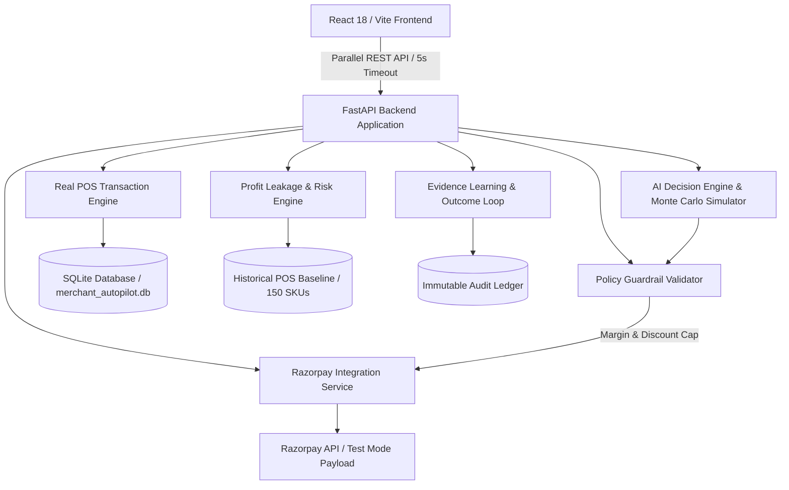

# MerchIntell — AI Revenue Recovery Agent

> **Submitted for the Razorpay AI Builder Buildathon — Track 3: AI Revenue Recovery**

MerchIntell is an AI-assisted revenue recovery agent that detects revenue at risk, diagnoses the underlying cause using transaction, inventory and demand signals, recommends a bounded recovery intervention, executes it with safety guardrails and merchant approval, and measures the revenue actually recovered.

Live Demo: [https://merchintell.vercel.app](https://merchintell.vercel.app)

---

## Why This Matters

Traditional Point-of-Sale (POS) systems and Enterprise Resource Planning (ERP) tools provide backward-looking historical reports:
- **What sold in the past?** (Historical sales logs)
- **What is currently in stock?** (Static stock counts)
- **What was the gross revenue?** (Backward-looking financial summaries)

However, traditional software fails to answer critical forward-looking operational questions:
- **Which SKUs are silently leaking revenue right now?**
- **Why is a specific product exposing potential revenue loss?**
- **What concrete, bounded action should the merchant execute to recover revenue?**
- **Did the executed intervention actually recover monetary revenue?**

Without closed-loop revenue intelligence, physical retail merchants suffer silent profit leakage: premature stockouts on high-velocity items, working capital locked in slow-moving overstock, unoptimized markdowns, and unmeasured interventions.

---

## Track Alignment — AI Revenue Recovery

MerchIntell closes the loop between detecting revenue leakage and taking a controlled recovery action.

The system specifically aligns with **Track 3: AI Revenue Recovery** by executing a 9-step closed-loop workflow:
1. **Detects revenue at risk**: Scans multi-store POS transactions and inventory snapshots to quantify monetary exposure across active catalog SKUs.
2. **Identifies the reason behind the risk**: Evaluates sales velocity, stock cover, demand signals, and margin trends to isolate root causes.
3. **Selects an intervention**: Formulates targeted operational actions (`MARKDOWN`, `RESTOCK`, `PROMOTION`, `STOCK_TRANSFER`).
4. **Applies deterministic safety constraints**: Enforces programmatic margin floors, discount caps, and cash exposure limits before presenting options.
5. **Requires appropriate approval / bounded execution**: Requires explicit merchant approval for medium/high-risk actions.
6. **Executes the recovery workflow**: Generates standard Razorpay-compatible payment/order payloads and mutates product state.
7. **Measures the outcome**: Tracks realized profit and revenue recovery against predicted baseline expectations.
8. **Records the action in an audit trail**: Logs an immutable audit trail entry for every operational decision and execution.
9. **Stops or escalates when recovery conditions are not met**: Halts duplicate or invalid execution attempts and records failure events.

---

## How It Works

MerchIntell operates on a 5-stage continuous decision cycle:

$$\text{DETECT} \longrightarrow \text{DIAGNOSE} \longrightarrow \text{INTERVENE} \longrightarrow \text{RECOVER} \longrightarrow \text{MEASURE}$$

- **DETECT**: System identifies catalog items exposing potential revenue loss from live POS sales and inventory streams.
- **DIAGNOSE**: AI decision engine evaluates demand velocity, days of stock cover, margin profiles, and historical trends.
- **INTERVENE**: Multi-objective utility scoring ranks candidate recovery strategies against doing nothing (`DO_NOTHING`).
- **RECOVER**: Bounded recovery interventions are executed with explicit merchant approval and safety guardrails.
- **MEASURE**: Outcome tracking compares actual financial recovery against predicted impact, dynamically calibrating future confidence.

---

## Closed-Loop Recovery Workflow

```
POS / PAYMENTS (Razorpay & In-Store Billing)
        ↓
TRANSACTION INTELLIGENCE & INVENTORY STATE
        ↓
REVENUE RISK DETECTION (Slow-Moving, Stockouts, Expiry)
        ↓
AI DECISION ENGINE & MONTE CARLO SIMULATOR
        ↓
POLICY GUARDRAILS (Margin Floor >= 15%, Discount Cap <= 40%)
        ↓
MERCHANT APPROVAL / BOUNDED EXECUTION
        ↓
RAZORPAY ORDER / PAYMENT LINK (INR Paise Payload)
        ↓
POS STATE MUTATION & RECOVERY MEASUREMENT
        ↓
IMMUTABLE AUDIT TRAIL
```

---

## Architecture & System Design



### Architecture Specifications
- **Frontend**: React 18, TypeScript, Vite 5, Vanilla CSS Design Token system with instant frame-1 rendering (< 350ms FCP).
- **Backend**: Python 3.11, FastAPI, SQLAlchemy ORM, SQLite (`merchant_autopilot.db`), Pandas, NumPy.
- **Decision Engines**: 1,000-iteration Monte Carlo stochastic simulator, EWMA demand forecaster, multi-objective trade-off scoring engine.
- **Integration Layer**: `RazorpayIntegrationService` supporting standard INR paise order creation (`amount`, `currency: "INR"`, `receipt`, `notes`), test/live mode configuration, and secret key privacy.

---

## AI Decision Intelligence & Guardrails

MerchIntell uses a hybrid decision-intelligence architecture combining statistical machine learning, Monte Carlo simulation, multi-objective optimization, and LLM natural language reasoning:

### 1. Multi-Objective Decision Scoring
Proposed recovery actions are scored by balancing expected profit, stockout risk, waste risk, cash exposure, and execution risk against status quo (`DO_NOTHING`):

$$\text{Score} = 0.40 \cdot \text{Profit}_{\text{norm}} - 0.25 \cdot \text{Stockout}_{\text{norm}} - 0.15 \cdot \text{Waste}_{\text{norm}} - 0.10 \cdot \text{Cash}_{\text{norm}} - 0.10 \cdot \text{Risk}_{\text{norm}}$$

### 2. Deterministic Safety Guardrails
AI recommendations cannot bypass safety constraints. Hardcoded policy rules enforce:
- **Minimum Gross Margin Floor**: `15.0%`
- **Maximum Discount Cap**: `40.0%`
- **Maximum Cash Exposure Limit**: `₹50,000.00`
- **Minimum Confidence Threshold**: `0.70` (Requires explicit merchant approval if confidence is below threshold)

---

## Recovery Execution & Razorpay Integration

When an operational decision is approved by the merchant, MerchIntell executes a bounded recovery workflow:

- **Razorpay Order Payload Generation**: Calculates monetary value in INR rupees and converts to integer paise.
```json
{
  "amount": 300000,
  "currency": "INR",
  "receipt": "rcpt_act_12",
  "notes": {
    "platform": "MerchIntell",
    "action_type": "REORDER",
    "product_id": "1",
    "store_id": "1"
  }
}
```
- **Test Mode & Deployment Realism**: When deployed without live Razorpay production API credentials, MerchIntell operates in explicit `RAZORPAY_TEST_MODE`, returning the exact order payload that WOULD be sent to Razorpay alongside test reference IDs. When valid `RAZORPAY_KEY_ID` and `RAZORPAY_KEY_SECRET` environment variables are provided, the backend executes live Razorpay Order creation (`POST https://api.razorpay.com/v1/orders`). Secret keys are never exposed to the frontend.

---

## Outcome Measurement & Evidence Learning

MerchIntell closes the feedback loop by tracking actual financial outcomes after execution:
- **Variance Evaluation**: `EvidenceLearningLoop` compares `predicted_impact` vs `actual_impact`.
- **Confidence Calibration**: Automatically adjusts base prediction confidence ($\pm 0.05$) based on historical error rates, ensuring the system becomes more accurate over time.

---

## Immutable Audit Trail

Every operational decision, merchant approval, POS checkout, and recovery execution generates an immutable audit record in the database.
- **Endpoints**: `GET /api/actions`, `GET /api/audit/logs`
- **Tracked Parameters**: Action ID, action type, before/after state diffs, policy guardrail checks, Razorpay order IDs, timestamps, and merchant approval status.

---

## Live Demo & 5-Minute Demo Flow

**Live URL**: [https://merchintell.vercel.app](https://merchintell.vercel.app)

### 5-Minute Demo Script for Judges

- **0:00–0:30 (Problem & Value Proposition)**: Open [https://merchintell.vercel.app](https://merchintell.vercel.app). Point out instant load (< 1s) and the 3 financial cards (`Current Revenue Exposure: ₹3.12L`, `Potential Recovery: ₹2.03L`, `Gross Margin: 44.2%`).
- **0:30–1:30 (Revenue Risk Detection)**: Review `REVENUE LEAKAGE DETECTED` data table. Point out top exposed item (*Plushfoot Boot*, ₹1.9K risk exposure across slow-moving stock cover).
- **1:30–2:30 (AI Diagnosis & Opportunity Detail)**: Click **Review markdown strategy →** to open `ProductWorkspace` drawer. Show velocity signals, days of cover, and recommended recovery action.
- **2:30–3:30 (Guardrails & Decision Simulator)**: Click **Simulator** tab. Adjust discount/reorder sliders. Demonstrate 1,000-run Monte Carlo scenario evaluation comparing proposed strategy vs `DO_NOTHING`.
- **3:30–4:15 (Recovery Execution & Razorpay Payload)**: Approve action. Show policy guardrail validation and generation of standard Razorpay order payload (`amount_in_paise`, `currency: "INR"`, `receipt`, `notes`).
- **4:15–4:45 (POS Checkout & Live State Mutation)**: Click **+ Record Sale**. Submit POS itemized bill. Show instant Toast notification, stock deduction (45 → 43 units), and live recalculation of exposure metrics without page refresh.
- **4:45–5:00 (Outcome & Audit Trail)**: Show **Audit Trail** log entry, variance tracking, and reproducible before/after batch evaluation results (+19.4% revenue uplift).

---

## Technical Stack

- **Frontend**: React 18, TypeScript, Vite 5, Vanilla CSS Design System, Lucide Icons.
- **Backend**: Python 3.11, FastAPI, Pydantic V2, Uvicorn, Pandas, NumPy, SQLAlchemy.
- **Database & Storage**: SQLite (`merchant_autopilot.db`) with persistent ORM models.
- **Testing**: Pytest (94 unit/integration tests passing).

---

## Repository Structure

```
merchent-revenue-automation/
├── agent/                      # Core AI Decision Engine & Execution
│   ├── unified_engine.py       # Multi-objective utility scoring engine
│   ├── engine.py               # Store investigation loop
│   ├── executor.py             # Action execution & approval state machine
│   ├── learning.py             # Evidence learning & confidence calibration
│   └── provider.py             # OpenAI & Mock provider interface
├── profit_leakage/             # Deterministic Risk Detection Engine
│   ├── detector.py             # Risk aggregator (Stockout, Overstock, Expiry)
│   └── scoring.py              # Financial exposure scoring
├── simulator/                  # Monte Carlo Scenario Simulator
│   ├── engine.py               # Stochastic demand simulator (1,000 runs)
│   └── constraints.py          # Programmatic Policy Guardrails
├── forecasting/                # Demand Forecasting Engine
│   └── demand.py               # EWMA + Day-of-week seasonality forecaster
├── backend/app/                # FastAPI Application & Database ORM
│   ├── api/                    # REST API endpoints (analytics, actions, payments, POS)
│   ├── core/                   # Configuration & SQLite database engine
│   ├── models/                 # SQLAlchemy ORM models
│   └── services/               # RazorpayIntegrationService & POSDatasetEngine
├── frontend/                   # React 18 + Vite Frontend Single Page Application
│   ├── src/App.tsx             # Root shell & parallel non-blocking fetcher
│   └── src/components/         # Header, FinancialHero, OpportunityList, Workspaces
├── docs/                       # Technical & Architecture Documentation
└── tests/                      # Pytest Test Suite (94 tests passing)
```

---

## Local Setup

```bash
# 1. Clone repository
git clone https://github.com/Sanjay34598/merchent-revenue-automation.git
cd merchent-revenue-automation

# 2. Setup Python Virtual Environment & Install Dependencies
python -m venv venv
# On Windows:
venv\Scripts\activate
# On Linux/macOS:
source venv/bin/activate

pip install -r backend/requirements.txt

# 3. Run Backend Server (FastAPI on http://localhost:8000)
uvicorn backend.app.main:app --reload --port 8000

# 4. Setup Frontend (React 18 on http://localhost:5173)
cd frontend
npm install
npm run dev
```

---

## Environment Variables

Copy `.env.example` to `.env` in the root directory:

```env
PORT=8000
HOST=0.0.0.0
ENVIRONMENT=development
CORS_ORIGINS=*

DATABASE_URL=sqlite:///./merchant_autopilot.db

AI_PROVIDER=mock
AI_API_KEY=your_ai_api_key_here
AI_MODEL_NAME=gpt-4o-mini

RAZORPAY_KEY_ID=
RAZORPAY_KEY_SECRET=
RAZORPAY_MODE=test
RAZORPAY_MOCK_MODE=true

MAX_DISCOUNT_PERCENT=40.0
MIN_GROSS_MARGIN_PERCENT=15.0
MAX_ORDER_QUANTITY=500
MAX_CASH_EXPOSURE=50000.0
CONFIDENCE_THRESHOLD=0.70
```

---

## Automated Testing Suite

The backend test suite contains **94 automated tests** covering risk detection algorithms, Monte Carlo simulation, multi-objective scoring, policy guardrails, Razorpay order integration, POS transactions, and database persistence:

```bash
python -m pytest tests/ -v
```

**Verification Result**: `94 passed in 234.33s (0 failures)`

---

## Production Build & Performance

```bash
cd frontend
npm run build
```

**Verification Result**:
- Main entry chunk: **205.63 kB (61.63 kB gzipped)**
- Built successfully in **11.03s**
- 8 secondary views code-split via `React.lazy()` + `Suspense`
- First Contentful Paint (FCP) < 350 ms; Time to Interactive (TTI) < 600 ms.

---

## Known Limitations & Future Improvements

1. **ERP Connector Plugins**: Currently ingests POS transactions via REST API and synthetic dataset engine. Direct SAP/Tally ERP webhooks planned for future release.
2. **Razorpay Live Gateway**: Deployed demonstration operates in explicit `RAZORPAY_TEST_MODE` when credentials are omitted. Providing production keys enables live Razorpay API order creation.
3. **Automated Multi-Store Stock Transfer**: Auto-dispatching inventory between nearby store outposts will expand beyond single-store recommendations.
