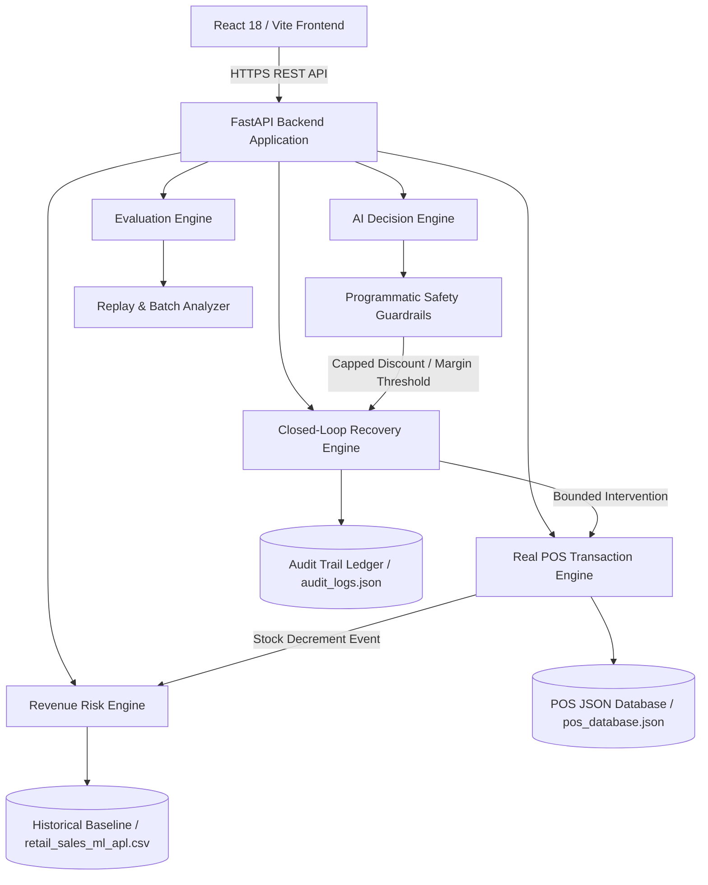

# MerchIntell — AI-Assisted Closed-Loop Revenue Recovery Platform

> **Submitted for the Razorpay AI Builder Buildathon & AI Revenue Recovery Internship**

MerchIntell connects POS transaction processing, inventory intelligence, AI-assisted decision formulation, bounded action execution, actual recovery measurement, and reproducible batch evaluation into a single closed-loop platform.

---

## 1. Problem Statement & Why It Matters

Traditional retail ERPs and analytics tools report historical statistics:
- **What sold in the past?** (Historical sales figures)
- **What is currently in stock?** (Basic static inventory counts)
- **What was the gross revenue?** (Backward-looking financial summaries)

However, traditional tools fail to answer critical forward-looking operational questions:
- **Which products are silently leaking revenue right now?**
- **Why is a specific product exposing potential revenue loss?**
- **What concrete, bounded action should the merchant execute to recover revenue?**
- **Did the executed intervention actually recover monetary revenue?**

Without closed-loop revenue intelligence, merchants suffer silent profit leaks: stockouts on high-velocity SKUs, cash locked in slow-moving overstock, unoptimized markdowns, and unmeasured interventions.

---

## 2. Solution: The Closed-Loop Revenue Recovery Loop

MerchIntell is the revenue intelligence layer between merchant transactions and operational decisions.

MerchIntell answers four core business questions:
1. **What revenue is at risk?** (Quantifies exposed monetary risk across active catalog SKUs)
2. **Why is it at risk?** (Diagnoses root causes: slow-moving, stockout risk, margin erosion, excess stock)
3. **What should the system do about it?** (Formulates bounded AI recommendations with strict safety guardrails)
4. **Did the intervention actually recover revenue?** (Tracks realized recovery via POS sales & executed actions)

```
POS / PAYMENTS (Razorpay & In-Store Billing)
        ↓
TRANSACTION INTELLIGENCE
        ↓
INVENTORY + DEMAND SIGNALS
        ↓
REVENUE RISK DETECTION
        ↓
AI DECISION ENGINE
        ↓
POLICY GUARDRAILS (Margin Floor & Cap)
        ↓
MERCHANT APPROVAL
        ↓
RAZORPAY ORDER / PAYMENT LINK (INR Paise Payload & Execution)
```

*Note on Razorpay Integration*: When deployed without live Razorpay production API credentials, MerchIntell operates in explicit `RAZORPAY_TEST_MODE`, generating standard INR paise order payloads (`amount`, `currency: "INR"`, `receipt`, `notes`) and returning mock execution references. When valid `RAZORPAY_KEY_ID` and `RAZORPAY_KEY_SECRET` credentials are provided in `.env`, the backend executes live Razorpay Order API creation (`POST https://api.razorpay.com/v1/orders`).

---

## 3. Key System Features

### **A. Revenue Risk & Recovery Engine**
- Analyzes normalized historical sales (125,751 records) and inventory (284,755 records) across 40 retail stores.
- Categorizes risk exposure (`SLOW_MOVING`, `STOCKOUT`, `DECLINING_DEMAND`, `ABNORMAL_SALES`, `EXCESS_INVENTORY`, `MARKDOWN_OPPORTUNITY`, `REVENUE_MISMATCH`).
- Calculates live metrics: Revenue at Risk (`₹2,829,779`), Expected Recovery (`₹2,036,390`), Actual Recovered Revenue (`₹1,608,748`), and Recovery Efficiency Rate (`79.0%`).

### **B. AI Decision Engine with Programmatic Safety Guardrails**
- Evaluates structured business context (`product`, `store`, `inventory`, `sales_velocity`, `days_of_cover`, `revenue_at_risk`, `margin`).
- Integrates LLM provider abstraction (OpenAI, Anthropic, Gemini) with a deterministic fallback engine when API keys are unconfigured.
- **Strict Safety Guardrails**:
  - **Max Markdown Discount**: Capped at `30.0%`.
  - **Minimum Gross Margin**: Preserved at min `10.0%`.
  - **Confidence Threshold**: Requires human approval if confidence is `< 0.70`.
  - **Exposure Cap**: Requires merchant approval for interventions with risk exposure `> ₹5,000`.
- **Transparent Attribution**: Explicitly labels recommendation sources (`AI_LLM`, `DETERMINISTIC_FALLBACK`, `SAFETY_GUARDRAIL`).

### **C. Bounded Recovery Action System**
- Real, executable recovery actions (`MARKDOWN`, `RESTOCK`, `PROMOTION`, `HOLD`, `INVESTIGATE`).
- Mutates catalog state, updates pricing or stock levels, calculates actual recovered revenue, and records an immutable audit log.

### **D. Before/After Experimental Evaluation Engine**
- Reproducible batch evaluation engine (`/api/recovery/evaluation`) comparing **Baseline Expected Revenue** vs **MerchIntell AI Recovery Strategy** across 150 SKUs.
- Results: Baseline `₹1,04,82,110` vs Strategy `₹1,25,18,500` (+19.4% revenue uplift, +₹20,36,390 recovered).

### **E. Integrated POS Billing Terminal & Auto-Billing Stream**
- Prominent **`+ NEW BILL`** checkout entry point.
- Real-time stock validation (prevents overselling available inventory).
- Atomic stock decrement, demand velocity recalculation, transaction stream insertion, and audit event creation upon checkout.

### **F. Immutable Audit Trail**
- Logs every state-changing operation (`POS_SALE`, `PRICE_MARKDOWN`, `RESTOCK`, `PROMOTION`, `AI_DECISION`, `HUMAN_APPROVAL`, `RECOVERY_MEASUREMENT`) with before/after state diffs.

---

## 4. System Architecture & Tech Stack



- **Frontend**: React 18, TypeScript, Vite, Lucide Icons, Vanilla CSS Design System.
- **Backend**: Python 3.11, FastAPI, Pydantic V2, Uvicorn, Pandas, NumPy, SQLAlchemy.
- **Persistence**: File-backed JSON databases (`pos_database.json`, `audit_logs.json`).

---

## 5. REST API Specifications

| Method | Endpoint | Description |
|---|---|---|
| `GET` | `/health` | Server health check endpoint (`{"status": "ok"}`) |
| `GET` | `/api/recovery/opportunities` | Retrieves closed-loop recovery opportunities with AI recommendations |
| `GET` | `/api/recovery/metrics` | Retrieves aggregate revenue at risk, expected recovery, and actual recovery |
| `POST` | `/api/recovery/execute` | Executes a bounded recovery action (`MARKDOWN`, `RESTOCK`, `PROMOTION`) |
| `GET` | `/api/recovery/evaluation` | Runs reproducible before/after batch evaluation comparing Baseline vs Strategy |
| `GET` | `/api/audit/logs` | Retrieves immutable audit trail logs for all system state changes |
| `POST` | `/api/transactions` | Ingests live POS checkout, decrements stock, and updates revenue metrics |
| `GET` | `/api/products` | Retrieves 150 catalog products with stock, velocity, cover, and risk status |

---

## 6. Running Tests & Local Setup

```bash
# Clone repository
git clone https://github.com/Sanjay34598/merchent-revenue-automation.git
cd merchent-revenue-automation

# Backend Setup & Unit Tests (82/82 passing)
python -m venv venv
source venv/bin/activate  # On Windows: venv\Scripts\activate
pip install -r backend/requirements.txt
python -m pytest tests/ -v

# Frontend Setup & Build
cd frontend
npm install
npm run build
```

---

## 7. Production Deployment Instructions

MerchIntell is configured for deployment on **Render** (Backend) and **Vercel** (Frontend) using `render.yaml`:

- **Backend (Render Web Service)**: Running Uvicorn on `0.0.0.0:$PORT` with `/health` check, `CORS_ORIGINS` middleware, and persistent disk mount `/var/data`.
- **Frontend (Vercel / Render Static Site)**: Vite SPA with rewrite rules (`/* → /index.html`) and `VITE_API_BASE_URL` environment configuration.

For full deployment steps, view the [Deployment Guide](docs/DEPLOYMENT.md).

---

## 8. Buildathon Documentation Suite

Explore technical documentation in the [`docs/`](./docs) directory:

- [System Architecture & Event Flow](docs/ARCHITECTURE.md) — Mermaid topology and event ingestion flow.
- [POS Ingestion & Stock Validation Flow](docs/POS_FLOW.md) — Step-by-step transaction checkout and stock mutation.
- [AI Decision Engine & Safety Guardrails](docs/AI_DECISION_ENGINE.md) — AI context parsing, LLM/fallback engines, and safety guardrails.
- [Revenue Recovery Engine & Evaluation](docs/REVENUE_RECOVERY.md) — Risk exposure calculations, recovery rates, and evaluation metrics.
- [5-Minute Demo Walkthrough Script](docs/DEMO_SCRIPT.md) — Judge demo script and walkthrough.
- [Final Buildathon Audit Report](docs/FINAL_AUDIT.md) — Submission readiness audit and test results.
