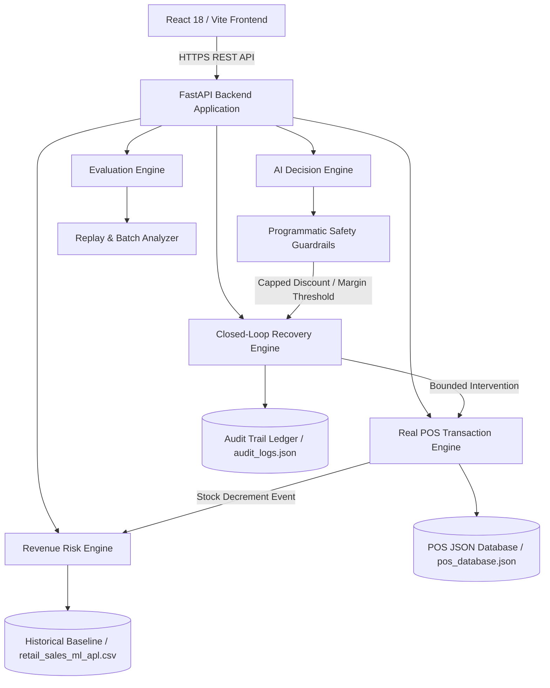

# MerchIntell — Technical Architecture & Event Flow

## High-Level Topology

---

## Closed-Loop Event Ingestion Flow

1. **POS Sale Event**:
   - Customer completes checkout via POS Terminal or Auto-billing Stream (`POST /api/transactions`).
   - `RealPOSEngine` validates stock availability (`current_stock >= requested_qty`).
   - Atomically decrements catalog inventory (`current_stock = current_stock - qty_sold`).
   - Recalculates 30-day daily velocity (`sold_stock / 30.0`) and days of stock cover (`current_stock / daily_velocity`).
   - Persists transaction record to file-backed DB (`pos_database.json`).
   - Generates immutable audit event in `audit_logs.json`.

2. **Revenue Risk Exposure Recalculation**:
   - `RevenueRiskEngine` recalculates risk exposure across all catalog SKUs.
   - Flagged categories: `SLOW_MOVING`, `STOCKOUT`, `MARGIN_LEAK`, `OVERSTOCK`.

3. **AI Decision Formulation**:
   - `AIDecisionEngine` builds structured context: `{ product, store, inventory, sales_velocity, days_of_cover, revenue_at_risk, margin }`.
   - Formulates structured recommendation (`action`, `reasoning`, `confidence`, `expected_recovery`).
   - Applies strict safety guardrails (max 30% discount, min 10% gross margin, 0.70 confidence threshold, human approval requirement).

4. **Bounded Recovery Action Execution**:
   - Merchant or Autopilot triggers `POST /api/recovery/execute`.
   - Modifies product state (e.g. price adjustment or stock replenishment).
   - Recalculates expected vs actual recovered revenue.
   - Logs `RECOVERY_ACTION_EXECUTED` event to Audit Repository.

5. **Outcome Measurement & Evaluation**:
   - `EvaluationEngine` aggregates actual realized revenue vs baseline expected revenue.
   - Updates Recovery Efficiency Rate (`actual_recovered_revenue / expected_recovery * 100`).
