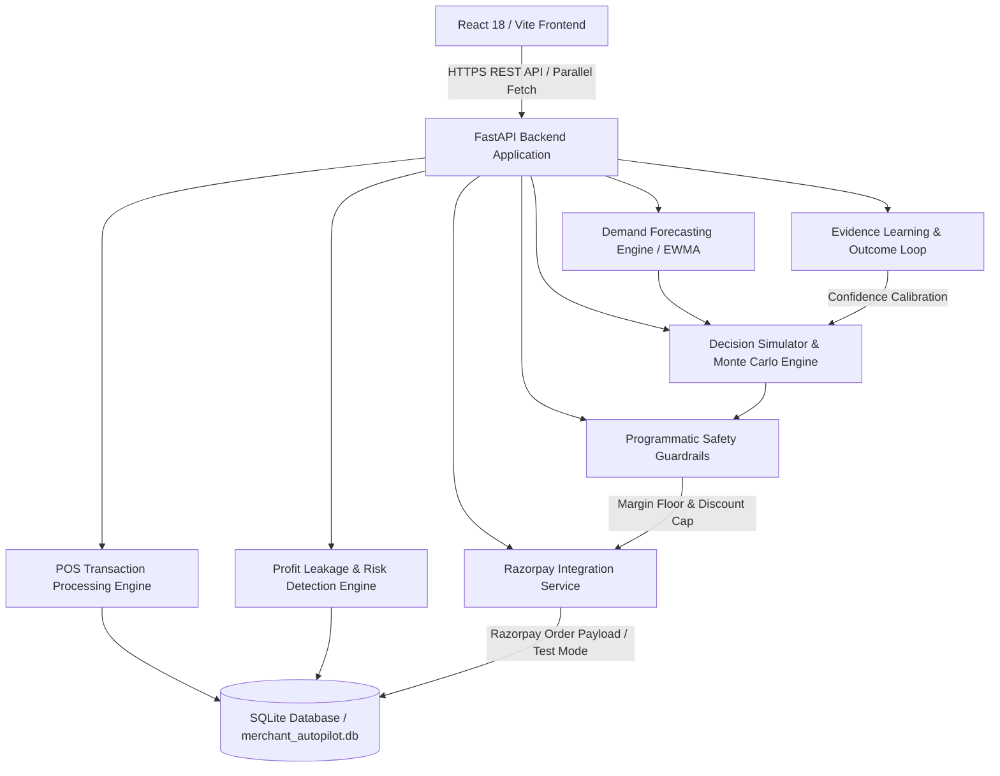

# MerchIntell — Technical Architecture & Closed-Loop Recovery Agent

## High-Level Topology

---

## Closed-Loop Recovery Flow

$$\text{DETECT} \longrightarrow \text{DIAGNOSE} \longrightarrow \text{INTERVENE} \longrightarrow \text{RECOVER} \longrightarrow \text{MEASURE}$$

1. **POS Sale / Transaction Ingestion**:
   - Customer completes checkout via POS terminal or API stream (`POST /api/transactions`).
   - `POSDatasetEngine` validates stock availability (`current_stock >= requested_qty`).
   - Atomically decrements catalog inventory (`current_stock = current_stock - qty_sold`).
   - Recalculates 30-day daily velocity (`sold_stock / 30.0`) and days of stock cover (`current_stock / daily_velocity`).
   - Persists transaction record to SQLite database (`merchant_autopilot.db`).
   - Triggers live metric recalculation across all open dashboard views without page refresh.

2. **Revenue Risk Exposure Recalculation**:
   - `ProfitLeakageDetector` scans catalog inventory to detect revenue exposure.
   - Leakage categories: `SLOW_MOVING`, `STOCKOUT`, `EXPIRY`, `DISCOUNT_INEFFICIENCY`, `SUPPLIER_COST`.
   - Computes Current Revenue Exposure across active opportunities (`₹3.12L` detected across priority risks).

3. **AI Decision Formulation & Monte Carlo Simulation**:
   - `DecisionSimulatorEngine` runs 1,000 Monte Carlo stochastic simulation iterations sampling over Gaussian demand distributions.
   - Evaluates expected gross profit, stockout risk, waste risk, and cash exposure across discount steps and order quantities.
   - `RevenueDecisionEngine` normalizes metrics and ranks candidate strategies against status quo (`DO_NOTHING`):
     $$\text{Score} = 0.40 \cdot \text{Profit}_{\text{norm}} - 0.25 \cdot \text{Stockout}_{\text{norm}} - 0.15 \cdot \text{Waste}_{\text{norm}} - 0.10 \cdot \text{Cash}_{\text{norm}} - 0.10 \cdot \text{Risk}_{\text{norm}}$$

4. **Programmatic Policy Guardrail Enforcement**:
   - AI recommendations cannot bypass safety constraints. Hardcoded policy rules enforce:
     - **Minimum Gross Margin Floor**: `15.0%`
     - **Maximum Discount Cap**: `40.0%`
     - **Maximum Cash Exposure Limit**: `₹50,000.00`
     - **Minimum Confidence Threshold**: `0.70` (Requires merchant approval if confidence is below threshold)
     - **Duplicate Action Guard**: Re-executing an executed action returns HTTP 409 and logs a `DUPLICATE_ACTION` audit failure event.

5. **Bounded Recovery Action Execution & Razorpay Integration**:
   - Merchant approves action via `POST /api/actions/{id}/approve`.
   - `RazorpayIntegrationService` converts monetary amount to integer paise and builds standard Razorpay order payload (`amount`, `currency: "INR"`, `receipt`, `notes`).
   - If `RAZORPAY_KEY_ID` and `RAZORPAY_KEY_SECRET` credentials are omitted, returns `status: "RAZORPAY_TEST_MODE"` with test reference payload. If valid keys exist, executes live Razorpay Order API creation.
   - Action state switches from `PENDING` → `APPROVED` → `EXECUTED`.

6. **Outcome Measurement & Evidence Learning**:
   - `EvidenceLearningLoop` tracks `predicted_impact` vs `actual_impact` in `ActionOutcome` database table.
   - Dynamically adjusts base prediction confidence ($\pm 0.05$) based on prediction error percentage.
   - Appends immutable audit record to `agent_actions` and `audit_logs` tables.
