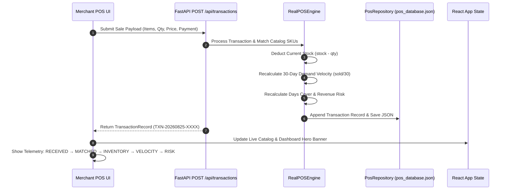

# MerchIntell — POS Transaction Flow & Processing Pipeline

## Overview

The Point-of-Sale (POS) transaction flow represents MerchIntell's core closed-loop ingestion engine. Every completed sale immediately updates inventory stock, demand velocity, revenue exposure, and decision recommendations.

---

## Transaction Ingestion Architecture

---

## Processing Pipeline Telemetry

When a transaction is processed, MerchIntell displays honest, merchant-facing telemetry stages:

1. **RECEIVED**: Ingestion payload received with line item count and payment mode (`UPI` / `Card` / `Cash`).
2. **MATCHED**: Matching catalog SKUs identified by product name or SKU ID.
3. **INVENTORY UPDATED**: Stock levels deducted atomically (`Inventory updated: 30 → 28`).
4. **VELOCITY UPDATED**: 30-day daily velocity recalculated (`dailyVelocity = soldStock / 30.0`).
5. **RISK UPDATED**: Store revenue exposure and decision engine recommendations updated.

---

## Customer Receipt & Invoice Generation

Upon sale completion, MerchIntell generates a clean invoice receipt:
- **Invoice Number**: `INV-20260825-XXXX`
- **Store Identifier**: `STR-1001` .. `STR-1040`
- **Timestamp**: Exact transaction timestamp
- **Payment Method**: `UPI`, `Card`, or `Cash`
- **Line Items**: Product name, quantity, unit price, line total
- **Subtotal & Grand Total**: Net payable amount in ₹
- **Actions**: `[ Print Receipt ]`, `[ Record Another Sale ]`, `[ Back to Command Center ]`
