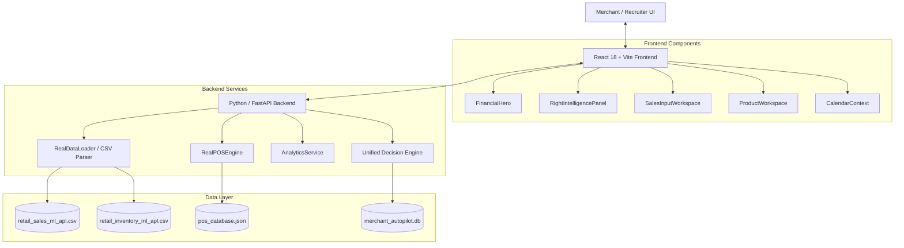

# MerchIntell — System Architecture

## System Diagram

---

## Component Topology

### 1. Frontend Layer (`frontend/src/`)
- **Technology**: React 18, TypeScript, Vite, Vanilla CSS Design System, Lucide Icons.
- **Role**: Renders the minimalist merchant command center, store selector (`STR-1001` .. `STR-1040`), POS billing terminal, Live Store Activity stream, and Product Intelligence slide-over drawer.
- **State Management**: React state hooks (`useState`, `useEffect`, `useCallback`) managing live merchant catalog, transaction ledger, and store selection.

### 2. Backend API Layer (`backend/app/`)
- **Technology**: Python 3.11, FastAPI, Pydantic, Uvicorn.
- **Role**: Exposes REST endpoints for transactions, analytics, store metrics, product performance, decision simulations, and autopilot actions.

### 3. Core Engine Layer (`backend/app/services/` & `agent/`, `profit_leakage/`)
- **`RealDataLoader`**: Loads and indexes 125,751 historical sales records and 284,755 inventory records.
- **`RealPOSEngine`**: Validates transactions, decrements runtime inventory stock, recalculates 30-day demand velocity, updates revenue exposure, and computes analytics summaries.
- **`PosRepository`**: Handles JSON file persistence (`data/pos_database.json`) for transaction history.
- **`UnifiedDecisionEngine`**: Evaluates multi-objective scores for candidate merchant interventions.

### 4. Data Layer (`data/` & `merchant_autopilot.db`)
- **`retail_sales_ml_apl.csv`**: Historical sales dataset (125,751 rows).
- **`retail_inventory_ml_apl.csv`**: Historical inventory dataset (284,755 rows).
- **`pos_database.json`**: Persistent storage for live POS transactions.
- **`merchant_autopilot.db`**: SQLite database for action execution logs, decision history, and learning loop telemetry.
